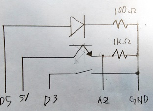

# 最初に
## これは何？
大学実験で行った成果物です。  

ArduinoProcessingと以下の部品を使って新規性のあるユニークなものを作れという課題です。以下以外の持ち込み部品は使用不可。  
- Arduino(互換、Proなどはダメ)
- LED
- 抵抗
- 可変抵抗
- 加速度センサ
- 温度センサ
- フォトトランジスタ(照度センサ)
- サーボモーター
- DCモーター(途中から使えるようになった)
- スイッチ
- タクトスイッチ(途中から使えるようになった)
- スピーカ

## なんでGitHubに上げたの
このような何かを作る課題ではいつも実用性のある物を作ってきたが、何も実用性のあるものが思い浮かばなかった為。  
Arduino Proや7セグディスプレイが使えればもっとアイディアが広がったと思うんですけどね。  

## 何を作ったの？
ライントレーサーを作ろうと思ったが最初からは使えなくて、いつ入るか分からなかったので最初から使えないものは無いのも同然であるので、ライントレーサーの白黒を読み取るという所から着想を得て一次元バーコードリーダーを作りました。  

## P.S.
因みに提出したレポートは自分が書いた物を著作権侵害と言われて非常にムカついています。  
コメントにコメントを付けてやりました。  

最初は疑問系なのにその後ろで断定していることから、最初に疑問形で書いたのは建前で最初から写しただろと思っていることがこの文章から読み取れますね。  
中々ここまで人間の怒りを最高潮にすることはできませんよ、どの教授が書いたかは知りませんけど。  
エンジニアとして考えうる限り最大限の侮辱。  

それから中身の評価はせやろなという妥当な物でした。向こうが提示してきたフォーマットに沿って書きましたがこんな所に結論書くんかみたいな部分に結論があって(合計2箇所の結論)そこに対してツッコミが入っていました。自分もこんな所に結論なんて書かないと思ったわ。  

## 最初に終わり
ここから提出したレポートの建前などを除いてどう実現したのかを書いていきます。  
 
 
 

--------------------

 
 
 

# 前提条件
[make_barcode](make_barcode)でバーコード(JAN)を生成しました。  
A4サイズ横マックスになるようになっています。  
縦は紙がもったいないからいっぱい入るように。  
幅17cmの巨大一次元コードです。これ以上小さいと読み取れなかった。  

最終的にこんな感じでのシステムができました。  

# ハードウェア
Arduino NanoにフォトトランジスタとLEDと読み取り開始のためのボタンがあるのみです。  

回路はこんな感じ  

LEDとフォトトランジスタを縦に下を向けて並べてあります。  
これで紙に反射して返ってきた光を読み取ります。  
指向性の高いものほど周りの影響が少なくて読み取ったデータが解析しやすかったです。そもそも指向性が低い物は目で人力解析すらできませんでした。  

# ソフトウェア
Arduinoではボタンを押したらLEDが光って計測開始します。そのデータはシリアル通信でPC上に送られます。シンプル  
PCではProcessingを使って表の表示と解析を行いました。言語はKotlinを使用しました。  

## 解析方法
まずJANコードには4つのパターンがあります。この長ささえわかれば解析は可能です。この長さをどうやって得るのかを解説します。  
<table>
<caption>白の一次元コードのパターン</caption>
<tr>
    <td>長さ1</td>
    <td>長さ2</td>
    <td>長さ3</td>
    <td>長さ4</td>
</tr>
<tr>
    <td></td>
    <td></td>
    <td></td>
    <td></td>
</tr>
</table>

白いと反射、黒いと光を吸収してフォトトランジスタでは白のほうが大き値が得られます。  
これは直感的ではないので値を反転して表示させます。  
更に値が高速で上下したりするので範囲3で割って平均を取ります。その結果がこちらです。    

この上下した値の山から解析していきます。  

### 長さを使う方法
長さを取ればいいので変化した幅を取ろうとしましたが人の手でやると速度が変わってまともにデータが取れませんでした。  

### 明るさを使う方法
それぞれの長さの白色バーの中心にLEDとフォトトランジスタがある場合、左右の黒色との距離より、黒色の影響は長さ1が一番大きく、長さ4が一番影響が小さいです。  
よって白色の長さ4の時が一番フォトトランジスタで取れる値が大きくなります。上の図は反転させているので一番小さいところに来ます。黒色のバーの時も同様です。  

そこで、読み込んだJANコードの黒の長さ2,3,4のパターンを反映させて横に目印を引きます。  

解析できそうな気がしてきましたね？  
ただ長さ3と4ではあまり違いが分からないのでここは3と4は同じく3として扱います。  

この山の高さを順番に並べて一番変化が大きいところを閾値とします。これで1,2,3が区別が付きました。しかし3と4は区別が付かないままです。  
ここでJANコードの仕様が登場します。  
JANコードは一つの数字を4つのバー、長さ7で表現します。これにより3か4は絶対一回しか登場しないことがわかります。  
(パターンが白3,黒3,白1この時点で7になってしまうので。)  
なので4つのバーの長さの合計が6であれば中の3を4に変更してあげれば良いことが分かります。  

これによりJANコードをLEDとフォトトランジスタのみで読み取ることができます。  

# 動画
<iframe width="560" height="315" src="https://www.youtube.com/embed/SpNbRiaHo1k" frameborder="0" allow="autoplay; encrypted-media" allowfullscreen></iframe>

# LICENSE
 - barcode4j
    Apache License  
    Version 2.0, January 2004  
    http://www.apache.org/licenses/  

 - avalon-framework-api 
    Apache License  
    Version 2.0, January 2004  
    http://www.apache.org/licenses/  

 - processing
    GNU GENERAL PUBLIC LICENSE  
    Version 2, June 1991  
    https://github.com/processing/processing/blob/master/license.txt  

 - jssc
    GNU LESSER GENERAL PUBLIC LICENSE  
    Version 3, 29 June 2007  
    https://github.com/arduino/Arduino/blob/master/arduino-core/lib/jssc.LICENSE.LGPL.txt  

 - kotlin-stdlib-jdk8  
    Apache License  
    Version 2.0, January 2004  
    http://www.apache.org/licenses/  
